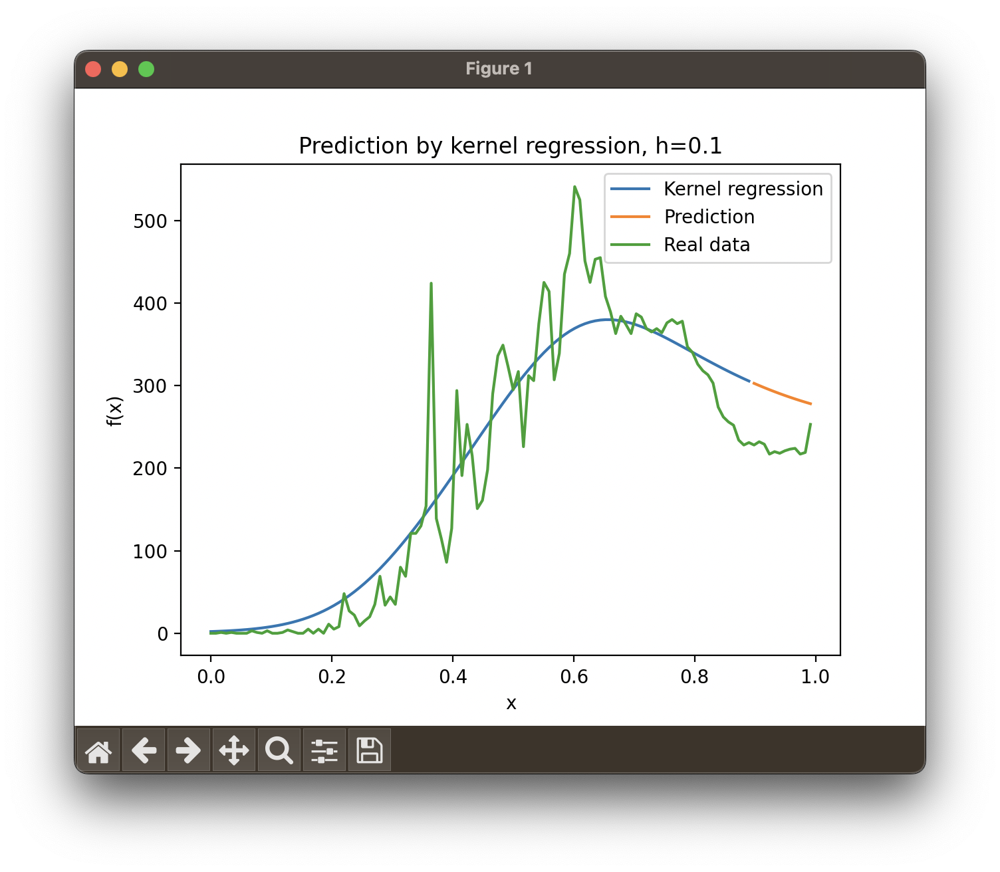

# KernelRegression

My realization of kernel regression in python3

## Goal

To master the modern method of filtering and constructing nonparametric regression to solve the forecasting problem in the analysis of big data dynamically captured in time.

It is required to build a prediction model based on the implementation of a nonparametric kernel regression algorithm.

## Initial data

As initial data, the statistics of the incidence of people from coronavirus in St. Petersburg from the beginning of March 2020 to the end of June 2020 were taken.

Source: [polymatica.ru](https://www.polymatica.ru/news/2020/dannye-po-koronavirusu-covid-19/?ysclid=lelcfa4b66884197378)

## Results

First plot is the density of used core. In picture below you can see "Gaussian kernel".
Some other cores are also available, but several aren't ploted (still works).

There is visualization of distribution in second picture. It's hist and kernel estimation of distribution density.

Third one is result of kernel regression.

Picture below is my first try to make weighted kernel regression. Result should be less affected by emissions, but now works bad (in my opinion, I'll try to fix it in future).

And finally, I tried to predict 10% of the last elements. It looks better than usage of linear function and don't have edge effect when extrapolated by a polynomial. But kernel regression is not suitable for extrapolation tasks.

